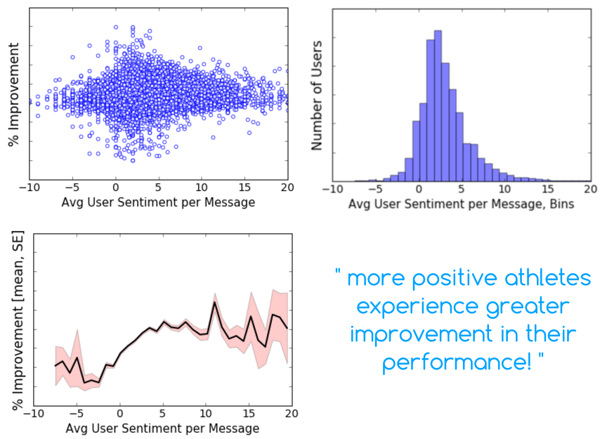
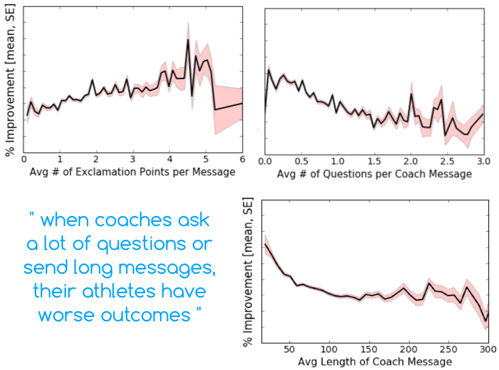
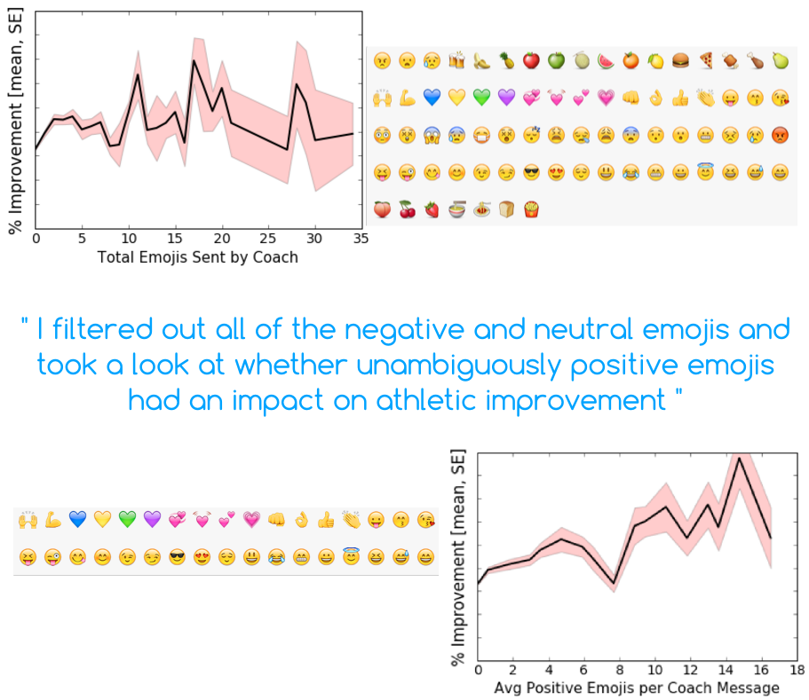
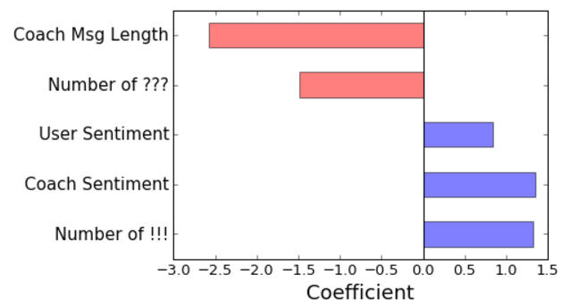

# Going the Distance: 
##Improving Outcomes with Smart Coaching

Behavioral change and self-improvement are often difficult to accomplish without the help of a supportive teacher. Even though technology is making it easier for us to track what we eat and how much we exercise, it's often all too easy to ignore advice when it's in the form of an automated message from a computer. Essentially, technology has not been able to replace a live teacher. Personal coaches, on the other hand, can provide invaluable support and advice to people who are trying to overcome fears and serious addictions, or to athletes trying to reach their peak performance. Recently, technology has made it possible for a single coach to assist multiple people, thus broadening the reach of who has access to a personal coach. 

While at Insight, I consulted for an anonymous company that employs certified health coaches to help triathletes improve their race times. Each user is paired with a personal coach who communicates remotely with the user to provide ongoing support and advice. Each user has a device to help them track their progress, and is able to share their calendar with a coach, who can help them plan and modify their daily exercise routines as it gets closer to their race day. The company utilizes success based pricing, meaning that product revenue is dependent on the success of their users. In other words, the user may not have to pay for the service if their race times do not actually improve. To increase their product revenue, the company could expand their market and get more athletes to sign up for their service, or the company could improve their existing product so that users have more successful outcomes. My project focused on the latter. I was given approximately 2 million messages between coaches and their athletes, in addition to metrics describing the athlete's performance and how frequently they interacted with the company's app to track their progress. 

##Objective 

My goal was to identify key features from coach-athlete messages that correlated with product "success." Improved outcomes (faster race times) represent the most obvious metric for "success," however user engagement is another sign of a successful product, since highly engaged users are more likely to exhibit improved outcomes and speak positively about the product to others. 

##Methodology

I extracted several features from coach-athlete messages that had the potential to be signals of athlete success. These features included the length of the messages, the message sentiment, punctuation (questions and exclamation points), and presence of emojis. Sentiment is a measure of how positive or negative a statement or group of statements is. I used a word-list based approach to sentiment analysis, meaning that each word was assigned a sentiment value (positive or negative). For example, the word "horrible" is assigned a value of -3, the word "good" is assigned a value of +3, and the word "terrific" is assigned a value of +4. The sentiment values are additive, so if the word "terrific" shows up in the same sentence as the word "good", then the setence's sentiment value will be +7 based on these 2 words alone. During my analysis, I discovered that the sentiment analyzer I was using ignored punctuation and emojis but did not ignore emoticons. Thus, I looked at punctuation and emojis separately.   

"Sentiment analysis" often gets a bad reputation in the world of natural language processing because it rarely picks up on the subtleties of the human language (sarcasm in particular). In addition, the word-list based approach that I used was so simplistic that the sentiment value of "terrific" would have been the same as the value for "not terrific." Luckily, coaches are rarely sarcastic and are far less likely to use statements like "not terrific" compared to the use of "terrific" by itself. Thus, for my data, assigning a sentiment score to a message from a coach was still a useful tool for looking at aggregated data. However, I would not apply these assumptions to smaller datasets or to data involving more complex text. 

Several outputs were tested as metrics of "success," including the number of log-ins, total number of messages sent by the athlete to the coach, and percent improvement (which could be the percent improvement in final race time accomplished by the athlete). Ultimately, percent improvement showed the greatest correlation for the features that I tested, so my analysis is presented here with respect to percent improvement. 

##Key Results

First, let's take a look at how user sentiment affects outcome. The plot on the upper left (below) shows how user sentiment is related to % Improvement for thousands of users. There are no immediate trends that can be seen from the data. However, when the data is binned, you may observe that most users have an average sentiment score around 3. Now, when you take the average of each bin (mean sentiment of hundreds of users), it's easier to see that there is a positive correlation between user sentiment and % Improvement (reference the plot showing a dark line with pink shading). Thus, the data reveals that more positive athletes experience greater improvement in their performance!

Next, I applied the same analysis to messages sent to athletes from their coach. In the plots below, you can see that athletes show greater improvement when their coaches send messages containing exclamation points. Perhaps this result suggests that enthusiastic coaches motivate athletes to perform better. In contrast, when coaches ask a lot of questions or send long messages, their athletes have worse outcomes. Perhaps one could speculate that lengthy messages full of questions overwhelm the athlete or cause them to lose motivation.

Lastly, I looked at the presence of emoji in the coach messages. The upper left plot (below) shows that there does not seem to be a correlation between the presence of emoji and the performance of the athlete. However, a closer look at the types of emoji that athletes are receiving from their coaches reveals that there were over 300 different types of emoji being sent to athletes, and some of those emoji are positive, some of them are negative, and some of them are completely neutral. I filtered out all of the negative and neutral emojis and took a look at whether unambiguously positive emojis had an impact on athletic improvement. Out of the 300 emojis sent from coaches to the athletes, only 34 of them were unambiguously positive. The lower right plot (below) shows that positive emojis may influence the athlete's outcome:

Finally, I plugged all of the important message features into a multivariate linear regression model with % Improvement as the outcome. For this, I used scikit learn's Ridge regression, which applies L2 regularization and accounts for multicollinearity. Indeed, longer messages are likely to have more punctuation, which results in correlated features. 

The model coefficients were normalized according to the respective mean of each variable. My results showed that emoji (positive or not) had no impact on athletic improvement. Perhaps it is culturally acceptable to use emoji in casual conversation without regard to their meaning. More likely, the data was simply not emoji-rich whereas it was rich in punctuation and sentiment. In the end, I removed the emoji feature from my model and developed the model with the remaining 5 features:

The model confirms that lengthy messages and messages containing questions have a negative impact on improvement. Athlete sentiment, coach sentiment, and presence of exclamation points in the messages all have positive correlations with % Improvement.

The R-squared value of this model was not particularly great (0.44), however it's important to recognize the large range with which people accept advice or support, and internalize enthusiasm or concern. Human behavior, in general, is really challenging to quantify and can rarely be predicted precisely from a model. My model shows general trends among thousands of users, and can only be used to understand trends in the coach-athlete interactions. 

If the company wanted to use this information to improve their product, they could limit the number of words each coach is allowed to send in one message. They could also implement real-time coach feedback where they provide coaches with the sentiment score of their message. There are some caveats, of course. More exclamation points, or less questions, is not necessarily a good thing and coaches will always need to use their best judgement. Imagine if you were a triathlete and received the following message from your coach:

"Your running pace was slower this month!! Try to incorporate more sprints and steep hills in your morning running route!!!"

The above statement is not exactly encouraging. In fact, it's a good example of the overuse of  exclamation points!

##Future Work and Important Considerations

The "science" of human behavior is inherently noisy: what percentage of people ignore advice from their teacher? what percentage of people self-motivate themselves even without a coach? If there was a way to filter out these people, you would be able to develop a cleaner data story. 

Lastly, an important consideration in this analysis is causality. The analysis I performed was entirely deductive, and so I did not address causality. A coach may be congratulating their athlete on getting faster or stronger and these types of congratulatory messages would be high in sentiment and exclamation points. Similarly, the coach could be asking the athlete questions because they are trying to understand where the athlete could focus on in the future. If I had more time to work on this project, I would have looked into cross-correlations in time series data for athlete improvement and coach sentiment (for instance) and determined how the lag between these two variables varied among users with different outcomes. This analysis would have helped suggest causality, however to truly delineate whether coach enthusiasm was a result of progress or whether enthusiasm caused progress, I believe the company would have to run a well-controlled experiment on actual users.

##Toolbox

Python - scripting language
Pandas - data wrangling
Sci-kit Learn - multivariate linear regression
Afinn - sentiment analysis
NLTK - natural language toolkit
Inkscape - vector illustration

##Presentation Slides

You can find presentation slides for this project [here][1].

[1]: https://docs.google.com/presentation/d/1KFzf9gNvJJAdZRrR1f0MBQfNuod6Xr9yXucFk45NaV4/pub?start=false&loop=false&delayms=60000